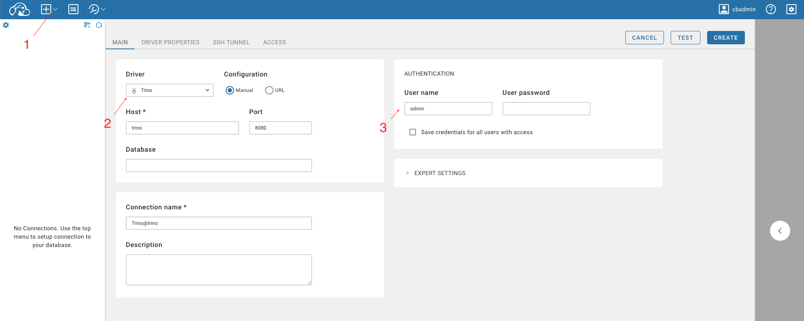

# trino-dbeaver-docker
How to run `trino` and `dbeaver` with `docker compose`

## Start services
```
docker compose up
```

## Open dbeaver UI

http://localhost:8978/

## Setup connection to trino



Host: `trino`, as the name of the service in the `compose.yaml` file  

```
services:
  trino:
```

Port: `8080`, as the container port, the right part of `"8080:8080"` in the `compose.yaml` file  

### Authentication
The default authentication for trino is:

`User name:` `admin`

`User password:` leave it empty

## Stop services
```
docker compose down -v
```
